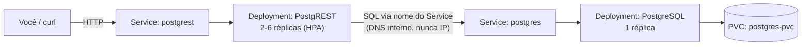

<h1 align="center">k8s-postgrest-challenge</h1>
<p align="center">
  API <a href="https://postgrest.org/">PostgREST</a> sobre PostgreSQL em Kubernetes —
  armazenamento persistente, privilégio mínimo, health checks, escala automática e CI/CD.
</p>

<p align="center">
  
  
  
  
  
  <br>
  
  
  
  
  
</p>

Stack completa rodando em Kubernetes: banco relacional com armazenamento persistente,
API REST conectada a ele por DNS interno, health checks, escala automática por CPU e
pipeline de CI/CD que valida tudo em um cluster criado do zero a cada execução.

Cada decisão de arquitetura está documentada com o raciocínio por trás dela e a evidência
do comportamento verificado.

-----

## 🏗️ Arquitetura



A API nunca se conecta ao banco por IP — ela usa o **nome do Service** (`postgres`) como
host na string de conexão, resolvido via DNS interno do cluster. Isso é o que permite o
Pod do banco ser recriado (perdendo IP) sem que a API perca a conexão. Detalhes em
[API conectada ao banco](docs/nivel-4-postgrest-integracao.md).

-----

## 🛠️ Ferramenta de cluster

**[kind](https://kind.sigs.k8s.io/)** (Kubernetes IN Docker), rodando dentro do WSL2
(Arch Linux) com integração ao Docker Desktop.

```bash
kind create cluster --name k8s-challenge
```

### Pré-requisitos

- Docker (com integração WSL2, se estiver no Windows)
- [`kind`](https://kind.sigs.k8s.io/docs/user/quick-start/#installation)
- [`kubectl`](https://kubernetes.io/docs/tasks/tools/#kubectl)
- `curl` (pra testar a API)

-----

## 📦 Dependências e versões

| Item | Versão | Papel |
|---|---|---|
| `kind` | v0.32.0 | cluster Kubernetes local |
| `kubectl` / nó do cluster | v1.36.1 | orquestração |
| `postgres` | 16.15 (`sha256:f1c3376c…`) | banco de dados |
| `postgrest/postgrest` | 16.3 (`sha256:ec0e25a4…`) | API REST |
| `metrics-server` | v0.9.0 | métricas de CPU para o HPA |
| Python | 3.12 | ambiente do pytest |
| `pytest` | 8.3.3 | testes automatizados |
| `requests` | 2.32.3 | cliente HTTP dos testes |
| `kubeconform` | v0.8.0 | validação de schema dos manifests |
| Checkov | 3.3.19 | análise estática de segurança |
| Semgrep | 1.177.0 | análise estática do código de teste |

Por que as versões estão fixadas por digest e não por tag: ver
[segurança e reprodutibilidade](docs/hardening-producao.md#imagens-fixadas-por-digest).

-----

## 🚀 Como aplicar

```bash
git clone https://github.com/MeloJu/k8s-postgrest-challenge.git
cd k8s-postgrest-challenge
kind create cluster --name k8s-challenge   # pule se já tiver um cluster
kubectl apply -f k8s/
kubectl get pods -n desafio-k8s -w         # espere tudo ficar Running/Ready
```

Ver [`k8s/README.md`](k8s/README.md) para o papel de cada manifest e a ordem de aplicação.

### HPA (opcional)

O HorizontalPodAutoscaler depende do `metrics-server`, que não vem instalado por padrão
no `kind`:

```bash
kubectl apply -f https://github.com/kubernetes-sigs/metrics-server/releases/download/v0.9.0/components.yaml
kubectl patch deployment metrics-server -n kube-system --type=json \
  -p '[{"op": "add", "path": "/spec/template/spec/containers/0/args/-", "value": "--kubelet-insecure-tls"}]'
```

(A flag `--kubelet-insecure-tls` é necessária porque o `kind` usa certificados
autoassinados nos kubelets — sem ela, o `metrics-server` sobe mas nunca reporta métricas.)

-----

## 🧪 Como testar

### Integração API ↔ banco

```bash
kubectl port-forward -n desafio-k8s svc/postgrest 3000:3000
```

Em outro terminal:

```bash
curl http://localhost:3000/todos
```

Numa instalação nova, retorna os registros de exemplo criados junto com a tabela:

```json
[
  {"id":1,"title":"Aplicar os manifests com kubectl apply -f k8s/","done":true},
  {"id":2,"title":"Testar a persistencia deletando o Pod do Postgres","done":false}
]
```

Uma resposta com dados reais aqui já confirma que a integração API↔banco está de pé.

### Inserir e ler um dado

```bash
curl -X POST http://localhost:3000/todos \
  -H "Content-Type: application/json" \
  -H "Prefer: return=representation" \
  -d '{"title": "minha primeira tarefa"}'

curl http://localhost:3000/todos
```

### Persistência

```bash
kubectl delete pod -n desafio-k8s -l app=postgres
kubectl wait --for=condition=Ready pod -n desafio-k8s -l app=postgres --timeout=90s
curl http://localhost:3000/todos   # o dado inserido antes ainda deve estar lá
```

Se o `curl` logo após a recriação retornar um erro `57P01` (conexão encerrada), é
esperado — o pool de conexões do PostgREST ainda apontava pro Pod antigo. Tente de novo;
ele reconecta sozinho — comportamento documentado em
[prova de persistência](docs/nivel-5-persistencia.md).

### Escalonamento automático

```bash
kubectl run load-generator -n desafio-k8s --image=busybox:stable --restart=Never -- \
  /bin/sh -c "for i in 1 2 3 4; do (while true; do wget -q -O- http://postgrest:3000/todos > /dev/null; done) & done; wait"
kubectl get hpa -n desafio-k8s -w   # observe REPLICAS subindo
kubectl delete pod load-generator -n desafio-k8s
kubectl get hpa -n desafio-k8s -w   # observe REPLICAS voltando ao mínimo
```

### Teste automatizado (o mesmo que o CD roda)

```bash
pip install -r tests/requirements.txt
pytest tests/ -v
```

-----

## 🧹 Limpeza

```bash
kubectl delete namespace desafio-k8s
kind delete cluster --name k8s-challenge   # se quiser remover o cluster inteiro também
```

-----

## 📚 Documentação

| Documento | Conteúdo |
|---|---|
| [Namespace e primeiro contato](docs/nivel-1-namespace-pod.md) | Isolamento por Namespace e por que workloads usam controladores |
| [PostgreSQL com armazenamento persistente](docs/nivel-2-postgres-pvc.md) | PVC, estratégia de rollout e Service interno |
| [Configuração e credenciais](docs/nivel-3-secret-configmap.md) | ConfigMap vs Secret, credenciais montadas como arquivo |
| [API conectada ao banco](docs/nivel-4-postgrest-integracao.md) | Papéis de privilégio mínimo e conexão por DNS do Service |
| [Exposição e prova de persistência](docs/nivel-5-persistencia.md) | Dado sobrevivendo à destruição do Pod do banco |
| [Health checks, limites e escala](docs/nivel-6-probes-escala.md) | Liveness vs readiness, requests/limits, réplicas |
| [Escalonamento automático](docs/nivel-7-hpa.md) | HPA por CPU, metrics-server e teste de carga |
| [Segurança e reprodutibilidade](docs/hardening-producao.md) | Imagens por digest, containers não-root, filesystem somente leitura |
| [CI/CD](docs/ci-cd.md) | Workflows, e o problema de reprodutibilidade que o pipeline encontrou |

-----

## 🔐 Segurança

- **Privilégio mínimo no banco**: a API conecta com um papel sem privilégios
  (`authenticator`) que assume `web_anon` — `SELECT` e `INSERT` em uma única tabela.
  `DELETE` é recusado pelo banco, e isso é verificado por
  [teste automatizado](tests/test_persistence.py).
- **Containers não-root**, com filesystem raiz somente leitura, todas as capabilities
  Linux removidas e `seccompProfile: RuntimeDefault`.
- **Credenciais entregues como arquivo**, nunca em variáveis de ambiente.
- **Segmentação de rede**: default deny de ingresso no namespace; o banco aceita conexões
  apenas dos Pods da API.
- **Imagens fixadas por digest**, garantindo que o mesmo `kubectl apply` produza o mesmo
  resultado em qualquer ambiente.

Detalhes e raciocínio em
[segurança e reprodutibilidade](docs/hardening-producao.md).

As credenciais versionadas são de demonstração: o banco é local, sem exposição externa, e
o papel usado pela API é o de privilégio mínimo acima. Em um ambiente com dados reais,
elas viriam do pipeline de deploy ou de um gestor externo de segredos.

-----

## 📁 Estrutura do repositório

```
k8s-postgrest-challenge/
├── 📂 k8s/                  # manifests numerados (ver k8s/README.md)
├── 📂 docs/
│   ├── 📄 nivel-N-*.md       # uma etapa da construção por arquivo
│   ├── 📄 hardening-producao.md  # segurança e reprodutibilidade
│   ├── 📄 ci-cd.md
│   └── 📂 evidencias/        # saídas de terminal reais referenciadas pelos docs
├── 📂 tests/                 # pytest: teste automatizado de persistência
└── 📂 .github/workflows/     # ci.yml (soft-fail) e cd.yml (hard-fail)
```

-----

## ⚙️ CI/CD

Dois workflows do GitHub Actions, detalhados em [docs/ci-cd.md](docs/ci-cd.md):

- **`ci.yml`**: em PRs para `develop`/`main` — kubeconform, Checkov (`k8s/`) e Semgrep
  (`tests/`). Soft-fail (reporta, não bloqueia).
- **`cd.yml`**: em push para `main` — sobe um cluster `kind` efêmero, aplica os
  manifests, espera tudo ficar `Ready`, roda `pytest` (incluindo o teste automatizado de
  persistência). Hard-fail.

O `cd.yml`, rodando num cluster efêmero de verdade, pegou uma lacuna real de
reprodutibilidade que só existia porque o cluster de desenvolvimento nunca tinha sido
recriado do zero — ver [o caso completo](docs/ci-cd.md#caso-real-o-passo-que-só-existia-no-meu-terminal).

-----

## 🔀 GitFlow

`main` (protegida, só recebe PR de `develop`), `develop` (integração) e uma branch
`feature/*`/`fix/*`/`chore/*` por entrega, cada uma com seu próprio PR:

Cada etapa — infraestrutura do banco, credenciais, API, escala, segurança, CI/CD — foi
integrada por um PR próprio, com o raciocínio registrado na descrição. Histórico completo
em [Pull Requests](https://github.com/MeloJu/k8s-postgrest-challenge/pulls?q=is%3Apr+is%3Amerged).

-----

## 👤 Autor

<table align="center">
  <tr>
    <td align="center">
      
      <br>
      <strong>Juan Melo</strong>
      <br>
      <a href="https://github.com/MeloJu" target="_blank">
        
      </a>
      <a href="https://www.linkedin.com/in/juan-melo-705626199/" target="_blank">
        
      </a>
    </td>
  </tr>
</table>

<p align="center">
  <sub>Cada decisão documentada com o raciocínio e a evidência do comportamento verificado.</sub>
</p>
