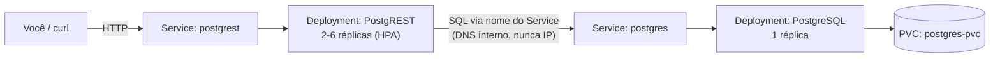

<h1 align="center">k8s-postgrest-challenge</h1>
<p align="center">
  API <a href="https://postgrest.org/">PostgREST</a> integrada a um PostgreSQL num cluster Kubernetes local —
  persistência de dados provada de verdade, configuração externalizada, health checks, escala automática e CI/CD real.
</p>

<p align="center">
  
  
  
  
  
  <br>
  
  
  
  
  
</p>

Feito como parte do desafio "Fundamentos de Kubernetes na Prática" do CloudOps Bootcamp
(S7 — Kubernetes), documentando cada nível progressivamente. Não é só a entrega final —
é o histórico completo de como cada peça foi construída, testada e por quê, incluindo os
erros reais encontrados no caminho (um deles, pelo próprio pipeline de CI/CD).

-----

## ✨ Destaques

- **Persistência provada com o cluster de verdade**, não só descrita: o dado sobrevive à
  deleção do Pod do banco, incluindo o comportamento real (e documentado) de reconexão do
  pool de conexões do PostgREST.
- **O CD achou um bug antes de qualquer avaliador ver**: a primeira execução num cluster
  efêmero falhou porque uma tabela só existia por um passo manual, nunca por manifest —
  corrigido e documentado como estudo de caso em [docs/ci-cd.md](docs/ci-cd.md).
- **Hardening guiado por dado real, não por achismo**: o Checkov encontrou 26 findings;
  11 foram corrigidos, e os 15 restantes foram conscientemente mantidos com justificativa
  técnica registrada — ver [docs/hardening-producao.md](docs/hardening-producao.md).
- **Evidências 100% fiéis**: nenhuma captura de terminal tem comando fabricado — o que
  aparece ecoado é exatamente o que rodou, warts and all (inclusive um erro real de
  conexão que virou evidência em vez de ser escondido).
- **GitFlow de verdade**: `main` protegida, um PR por nível, histórico completo e
  navegável em [Pull Requests](https://github.com/MeloJu/k8s-postgrest-challenge/pulls?q=is%3Apr+is%3Amerged).

-----

## 🏗️ Arquitetura



A API nunca se conecta ao banco por IP — ela usa o **nome do Service** (`postgres`) como
host na string de conexão, resolvido via DNS interno do cluster. Isso é o que permite o
Pod do banco ser recriado (perdendo IP) sem que a API perca a conexão. Ver a reflexão do
[Nível 4](docs/nivel-4-postgrest-integracao.md) para o detalhe completo.

-----

## 🛠️ Ferramenta de cluster

**[kind](https://kind.sigs.k8s.io/)** (Kubernetes IN Docker), rodando dentro do WSL2
(Arch Linux) com integração ao Docker Desktop.

```bash
kind create cluster --name k8s-challenge
```

### Pré-requisitos

- Docker (com integração WSL2, se estiver no Windows)
- [`kind`](https://kind.sigs.k8s.io/docs/user/quick-start/#installation)
- [`kubectl`](https://kubernetes.io/docs/tasks/tools/#kubectl)
- `curl` (pra testar a API)

-----

## 📦 Dependências e versões

| Item | Versão | Papel |
|---|---|---|
| `kind` | v0.32.0 | cluster Kubernetes local |
| `kubectl` / nó do cluster | v1.36.1 | orquestração |
| `postgres` | 16.15 (fixado por digest) | banco de dados |
| `postgrest/postgrest` | resolvido de `:latest` para 16.3, fixado por digest | API REST |
| `metrics-server` | último release | métricas de CPU pro HPA |
| Python (CI) | 3.12 | ambiente do pytest |
| `pytest` | 8.3.3 | teste automatizado de persistência |
| `requests` | 2.32.3 | cliente HTTP do teste |
| `kubeconform`, Checkov, Semgrep | últimas imagens | validação no `ci.yml` |

Por que as versões estão fixadas por digest e não por tag: ver
[docs/hardening-producao.md](docs/hardening-producao.md#1-imagens-fixadas-por-versãodigest).

-----

## 🚀 Como aplicar

```bash
git clone https://github.com/MeloJu/k8s-postgrest-challenge.git
cd k8s-postgrest-challenge
kind create cluster --name k8s-challenge   # pule se já tiver um cluster
kubectl apply -f k8s/
kubectl get pods -n desafio-k8s -w         # espere tudo ficar Running/Ready
```

Ver [`k8s/README.md`](k8s/README.md) para o que cada manifest faz e por que a numeração
não é cronológica.

### Bônus: HPA (Nível 7)

O HorizontalPodAutoscaler depende do `metrics-server`, que não vem instalado por padrão
no `kind`:

```bash
kubectl apply -f https://github.com/kubernetes-sigs/metrics-server/releases/latest/download/components.yaml
kubectl patch deployment metrics-server -n kube-system --type=json \
  -p '[{"op": "add", "path": "/spec/template/spec/containers/0/args/-", "value": "--kubelet-insecure-tls"}]'
```

(A flag `--kubelet-insecure-tls` é necessária porque o `kind` usa certificados
autoassinados nos kubelets — sem ela, o `metrics-server` sobe mas nunca reporta métricas.)

-----

## 🧪 Como testar

### Integração API ↔ banco

```bash
kubectl port-forward -n desafio-k8s svc/postgrest 3000:3000
```

Em outro terminal:

```bash
curl http://localhost:3000/todos
```

Deve retornar `[]` (tabela vazia, criada automaticamente — ver [docs/ci-cd.md](docs/ci-cd.md))
ou os registros já inseridos.

### Inserir e ler um dado

```bash
curl -X POST http://localhost:3000/todos \
  -H "Content-Type: application/json" \
  -H "Prefer: return=representation" \
  -d '{"title": "minha primeira tarefa"}'

curl http://localhost:3000/todos
```

### Persistência (o coração do desafio)

```bash
kubectl delete pod -n desafio-k8s -l app=postgres
kubectl wait --for=condition=Ready pod -n desafio-k8s -l app=postgres --timeout=90s
curl http://localhost:3000/todos   # o dado inserido antes ainda deve estar lá
```

Se o `curl` logo após a recriação retornar um erro `57P01` (conexão encerrada), é
esperado — o pool de conexões do PostgREST ainda apontava pro Pod antigo. Tente de novo;
ele reconecta sozinho (ver [Nível 5](docs/nivel-5-persistencia.md) pra evidência real
disso acontecendo).

### Escalonamento automático (bônus)

```bash
kubectl run load-generator -n desafio-k8s --image=busybox:stable --restart=Never -- \
  /bin/sh -c "for i in 1 2 3 4; do (while true; do wget -q -O- http://postgrest:3000/todos > /dev/null; done) & done; wait"
kubectl get hpa -n desafio-k8s -w   # observe REPLICAS subindo
kubectl delete pod load-generator -n desafio-k8s
kubectl get hpa -n desafio-k8s -w   # observe REPLICAS voltando ao mínimo
```

### Teste automatizado (o mesmo que o CD roda)

```bash
pip install -r tests/requirements.txt
pytest tests/ -v
```

-----

## 🧹 Limpeza

```bash
kubectl delete namespace desafio-k8s
kind delete cluster --name k8s-challenge   # se quiser remover o cluster inteiro também
```

-----

## 📚 Documentação por nível

Cada nível do desafio tem seu próprio documento com o que foi feito, os comandos usados,
evidências e a resposta à pergunta de reflexão proposta:

| Nível | Documento | Peso na avaliação |
|---|---|---|
| 1 — Namespace e primeiro contato | [docs/nivel-1-namespace-pod.md](docs/nivel-1-namespace-pod.md) | parte de "Organização" (10%) |
| 2 — PostgreSQL com persistência | [docs/nivel-2-postgres-pvc.md](docs/nivel-2-postgres-pvc.md) | parte de "PVC e persistência" (30%) |
| 3 — Secret e ConfigMap | [docs/nivel-3-secret-configmap.md](docs/nivel-3-secret-configmap.md) | "ConfigMap + Secret" (15%) |
| 4 — API conectada ao banco | [docs/nivel-4-postgrest-integracao.md](docs/nivel-4-postgrest-integracao.md) | "Integração API↔banco" (25%) |
| 5 — Expor a API e provar persistência | [docs/nivel-5-persistencia.md](docs/nivel-5-persistencia.md) | "PVC e persistência" (30%) |
| 6 — Health checks e escala | [docs/nivel-6-probes-escala.md](docs/nivel-6-probes-escala.md) | "Health checks + limits" (10%) |
| 7 — Escalonamento automático (bônus) | [docs/nivel-7-hpa.md](docs/nivel-7-hpa.md) | bônus, fora do peso oficial |

Documentos que vão além dos 7 níveis:

| Documento | Conteúdo |
|---|---|
| [docs/hardening-producao.md](docs/hardening-producao.md) | Imagens fixadas por digest, labels padrão, `strategy: Recreate`, achados do Checkov (corrigidos e conscientemente aceitos) |
| [docs/ci-cd.md](docs/ci-cd.md) | Design dos workflows + o bug real de reprodutibilidade que o `cd.yml` encontrou na primeira execução |

-----

## 🔐 Segurança — decisões conscientes, não descuido

Três trade-offs de segurança foram feitos de propósito neste projeto, e todos estão
documentados com o raciocínio completo (não só "é assim"):

1. **O Secret está commitado com uma senha real** ([Nível 3](docs/nivel-3-secret-configmap.md)) —
   aceitável porque é uma credencial descartável de um banco local, e o próprio critério
   de avaliação exige que o Secret seja visível no repositório.
2. **`PGRST_DB_ANON_ROLE` reaproveita o dono da tabela** ([Nível 4](docs/nivel-4-postgrest-integracao.md)) —
   numa API real, seria uma conta separada com só `SELECT`.
3. **15 findings do Checkov não foram corrigidos** ([hardening](docs/hardening-producao.md)) —
   principalmente porque removeriam capabilities Linux (`SETUID`/`SETGID`) que o
   entrypoint oficial do Postgres precisa pra funcionar. Testado, não presumido.

-----

## 📁 Estrutura do repositório

```
k8s-postgrest-challenge/
├── 📂 k8s/                  # manifests numerados (ver k8s/README.md)
├── 📂 docs/
│   ├── 📄 nivel-N-*.md       # um documento por nível do desafio
│   ├── 📄 hardening-producao.md
│   ├── 📄 ci-cd.md
│   └── 📂 evidencias/        # prints referenciados pelos docs acima (100% fiéis)
├── 📂 tests/                 # pytest: teste automatizado de persistência
└── 📂 .github/workflows/     # ci.yml (soft-fail) e cd.yml (hard-fail)
```

-----

## ⚙️ CI/CD

Dois workflows do GitHub Actions, detalhados em [docs/ci-cd.md](docs/ci-cd.md):

- **`ci.yml`**: em PRs para `develop`/`main` — kubeconform, Checkov (`k8s/`) e Semgrep
  (`tests/`). Soft-fail (reporta, não bloqueia).
- **`cd.yml`**: em push para `main` — sobe um cluster `kind` efêmero, aplica os
  manifests, espera tudo ficar `Ready`, roda `pytest` (incluindo o teste automatizado de
  persistência). Hard-fail.

O `cd.yml`, rodando num cluster efêmero de verdade, pegou uma lacuna real de
reprodutibilidade que só existia porque o cluster de desenvolvimento nunca tinha sido
recriado do zero — ver [a história completa](docs/ci-cd.md#um-bug-real-que-o-cdyml-encontrou-na-primeira-execução).

-----

## 🔀 GitFlow

`main` (protegida, só recebe PR de `develop`), `develop` (integração) e uma branch
`feature/*`/`fix/*`/`chore/*` por entrega, cada uma com seu próprio PR:

| # | O quê |
|---|---|
| 1-7 | Um PR por nível do desafio |
| 8 | Hardening de produção (guiado pelo Checkov) |
| 9 | README completo |
| 11 | Pipeline de CI/CD |
| 13 | Correção do bug de reprodutibilidade encontrado pelo CD |

Histórico completo e navegável em [Pull Requests](https://github.com/MeloJu/k8s-postgrest-challenge/pulls?q=is%3Apr+is%3Amerged).

-----

## 👤 Autor

<table align="center">
  <tr>
    <td align="center">
      <a href="https://github.com/MeloJu" target="_blank">
        
      </a>
      <a href="https://www.linkedin.com/in/juan-melo-705626199/" target="_blank">
        
      </a>
    </td>
  </tr>
</table>

<p align="center">
  <sub>CloudOps Bootcamp — S7 Kubernetes · Feito nível a nível, com os erros reais deixados à mostra.</sub>
</p>
