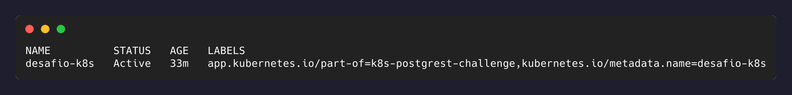
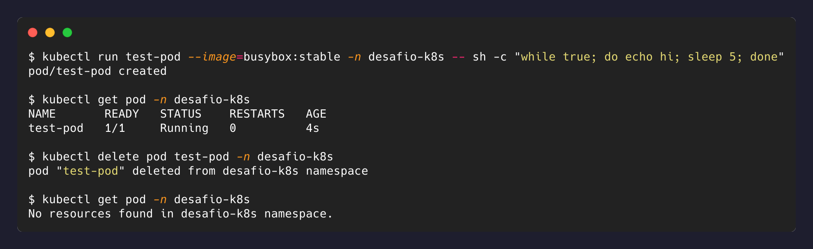

# Nível 1 — Namespace e primeiro contato

## Objetivo

Criar um Namespace próprio para o desafio, subir um Pod avulso de teste, inspecioná-lo e
depois deletá-lo, observando o que acontece.

## O que foi feito

### 1. Namespace

```bash
kubectl create namespace desafio-k8s
```

Um Namespace particiona o cluster logicamente: dois recursos com o mesmo nome podem
coexistir em Namespaces diferentes, e a maioria dos comandos `kubectl` só enxerga o
Namespace atual (ou `default`) a menos que se passe `-n`/`--namespace`. É o mecanismo de
isolamento pedido pelos critérios de aceitação do desafio.

O comando imperativo acima foi usado só pra explorar; o manifest declarativo equivalente,
que é o que fica versionado no repositório, está em [`k8s/00-namespace.yaml`](../k8s/00-namespace.yaml).

### 2. Pod avulso de teste

```bash
kubectl run test-pod --image=busybox:stable -n desafio-k8s \
  -- sh -c "while true; do echo hello from test-pod; sleep 5; done"
```

- `kubectl run` cria um Pod diretamente (sem Deployment/ReplicaSet por trás).
- Tudo depois de `--` é o comando executado dentro do container, substituindo o
  entrypoint padrão da imagem `busybox`.

### 3. Inspeção

```bash
kubectl get pod test-pod -n desafio-k8s
kubectl logs test-pod -n desafio-k8s
kubectl describe pod test-pod -n desafio-k8s
```

Pontos que apareceram no `describe` e valem registrar:

- **IP do Pod** (`10.244.0.5` na execução) — é um IP interno da rede do cluster,
  atribuído quando o Pod é agendado. Ele muda se o Pod for recriado. Essa efemeridade é
  o motivo pelo qual, no Nível 4, a conexão com o Postgres vai usar o **nome do Service**
  e não o IP do Pod.
- **QoS Class: BestEffort** — porque não foram definidos `requests`/`limits` de CPU/memória
  nesse Pod avulso. Isso volta no Nível 6.
- **Events**: `Scheduled → Pulling → Pulled → Created → Started`. Esse é o rastro que o
  `describe` deixa de tudo que o control plane tentou fazer — é a primeira coisa a olhar
  quando um Pod fica em `Pending` ou `CrashLoopBackOff`.

### 4. Deleção

```bash
kubectl delete pod test-pod -n desafio-k8s
kubectl get pod -n desafio-k8s
# No resources found in desafio-k8s namespace.
```

## Evidências

Namespace criado e rotulado:



Ciclo de vida completo do Pod avulso — criado, rodando, deletado, e a confirmação de que
não voltou:



## Reflexão

**Ao deletar esse Pod avulso, ele volta sozinho? Por quê?**

Não. Depois do `kubectl delete pod`, o `kubectl get pod` no namespace não mostra mais
nenhum recurso — o Pod não é recriado.

Isso acontece porque um Pod criado diretamente (via `kubectl run` ou um manifest `kind: Pod`
aplicado sozinho) não tem nenhum **controlador** por trás dele. Quem recria Pods
automaticamente no Kubernetes não é o Pod em si, é um controlador de nível mais alto — um
`ReplicaSet` (geralmente gerenciado por um `Deployment`), um `StatefulSet`, um `DaemonSet`,
etc. Esses controladores rodam um loop de reconciliação: eles guardam o "estado desejado"
(quantas réplicas devem existir) e ficam comparando com o estado atual do cluster; se um Pod
correspondente sumir, o controlador cria outro pra repor a diferença.

Um Pod avulso não tem esse "estado desejado" registrado em lugar nenhum — ele é, ele mesmo,
o próprio estado. Quando ele morre, não sobra nada guardando a intenção de que ele deveria
continuar existindo.

É exatamente por isso que **raramente criamos Pods diretamente** em uso real: eles não se
autorrecuperam de falha de container, não sobrevivem à realocação de nó, e não dão suporte
a rolling updates ou escala. Por isso o PostgreSQL e o PostgREST, a partir do Nível 2, vão
ser criados como `Deployment` — não como Pods soltos.
