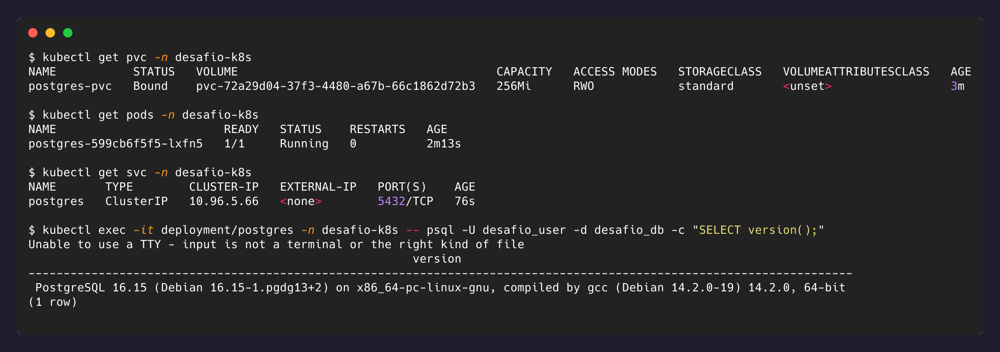

# 2 — PostgreSQL com armazenamento persistente

## PersistentVolumeClaim

[`k8s/03-postgres-pvc.yaml`](../k8s/03-postgres-pvc.yaml) reserva 256Mi em modo
`ReadWriteOnce` (um nó por vez, padrão para disco de bloco). O `storageClassName` é
omitido de propósito: o `kind` registra uma StorageClass `standard` como padrão
(`rancher.io/local-path`), e omitir o campo faz o PVC usar a padrão do cluster — o mesmo
manifest funciona em clusters com provisionadores diferentes.

```bash
kubectl get pvc -n desafio-k8s   # STATUS precisa ser Bound, não Pending
```

## Deployment

[`k8s/04-postgres-deployment.yaml`](../k8s/04-postgres-deployment.yaml), pontos de
decisão:

- **`replicas: 1`** — um PVC `ReadWriteOnce` só pode ser montado por um Pod por vez.
  Escalar este Deployment não é uma opção; detalhes em [nível 6](nivel-6-probes-escala.md).
- **`strategy: Recreate`** — a estratégia padrão (`RollingUpdate`) tentaria subir o Pod
  novo antes de derrubar o antigo, e o novo ficaria preso em `Pending` esperando o volume
  ser liberado. Ver [hardening](hardening-producao.md).
- **`PGDATA=/var/lib/postgresql/data/pgdata`** — aponta o Postgres para uma subpasta do
  volume montado, prática recomendada pela imagem oficial: se o diretório raiz do volume
  não estiver vazio (alguns provisionadores deixam `lost+found`), o `initdb` se recusa a
  rodar.
- **`volumes` vs `volumeMounts`** — `volumes` (nível Pod) declara *o quê* montar;
  `volumeMounts` (nível container) declara *onde*.

## Service

[`k8s/05-postgres-service.yaml`](../k8s/05-postgres-service.yaml) é `ClusterIP` (padrão):
alcançável apenas de dentro do cluster, que é o correto para um banco — só a API precisa
chegar nele. O nome do Service (`postgres`) é o endereço DNS usado pela API no
[nível 4](nivel-4-postgrest-integracao.md).

## Verificação

```bash
kubectl apply -f k8s/03-postgres-pvc.yaml -f k8s/04-postgres-deployment.yaml -f k8s/05-postgres-service.yaml
kubectl exec deployment/postgres -n desafio-k8s -- psql -U desafio_user -d desafio_db -c "SELECT version();"
```



## PVC vs emptyDir

Um `emptyDir` tem ciclo de vida atrelado ao Pod: some junto com ele, em qualquer cenário
de remoção (deleção manual, recriação pelo Deployment, realocação de nó). Serve para cache
ou troca de arquivos entre containers do mesmo Pod.

Um PVC é um objeto independente do Pod, vinculado a um volume real. Quando o Deployment
cria um Pod substituto, esse Pod monta o **mesmo** PVC — e portanto os mesmos dados. É
essa independência que sustenta a prova de persistência do
[nível 5](nivel-5-persistencia.md): o dado sobrevive porque nunca esteve dentro do Pod.
