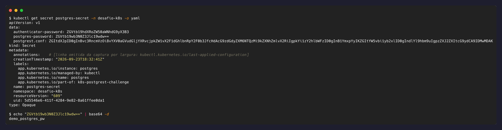
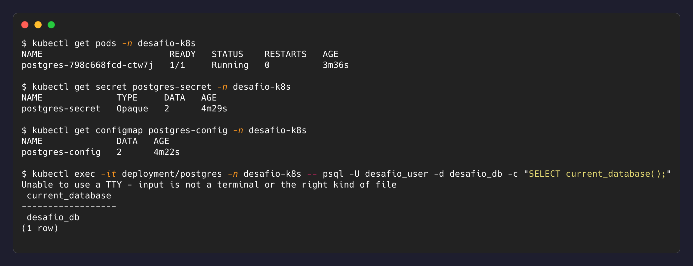

# 3. Configuração e credenciais

Separação entre o que é configuração (ConfigMap) e o que é credencial (Secret), e como
cada um é entregue ao container.

## ConfigMap

[`k8s/02-postgres-configmap.yaml`](../k8s/02-postgres-configmap.yaml) guarda o que não é
sensível: nome do banco, usuário, caminho do `PGDATA` e o script de inicialização
(`init.sh`) que cria a tabela, os papéis de acesso e os dados de exemplo.

## Secret

[`k8s/01-postgres-secret.yaml`](../k8s/01-postgres-secret.yaml) guarda três valores: a
senha do usuário dono do banco, a senha do papel `authenticator` usado pela API, e o
arquivo de configuração do PostgREST (que contém a string de conexão).

**Credenciais são entregues como arquivo, não como variável de ambiente:**

```yaml
- name: POSTGRES_PASSWORD_FILE
  value: /run/secrets/postgres/postgres-password
```

O Secret é montado em `/run/secrets/postgres` com modo `0440`, e o `fsGroup` do Pod dá
acesso de leitura apenas ao usuário do container. Variáveis de ambiente vazam com mais
facilidade: aparecem em `kubectl describe pod`, em dumps de processo (`/proc/<pid>/environ`)
e em logs de crash de muitas aplicações. Arquivo montado tem superfície menor e é o que a
imagem oficial do Postgres suporta nativamente através dos sufixos `_FILE`.

O mesmo vale para a API: a string de conexão do PostgREST vive em
`/etc/postgrest/postgrest.conf`, montado a partir do Secret, nunca em `env`.

## Base64 não é criptografia

Inspecionando o Secret aplicado, os valores aparecem codificados:

```bash
kubectl get secret postgres-secret -n desafio-k8s -o yaml
```



Qualquer um reverte isso com `base64 -d`, sem chave nenhuma. Codificação é mudança de
representação; criptografia exige uma chave para desfazer. O Secret do Kubernetes não
protege o valor; ele apenas o separa do manifest da aplicação e permite controlar o
acesso por outros mecanismos:

- **RBAC** restringindo quem faz `get`/`list` em Secrets no namespace.
- **Encryption at rest** no etcd (não habilitado por padrão em clusters locais).
- **Gestores externos** (Sealed Secrets, External Secrets Operator, Vault) quando o
  valor não pode transitar pelo repositório.

## Credenciais neste repositório

As credenciais versionadas aqui são de demonstração e existem para que
`kubectl apply -f k8s/` funcione em qualquer clone sem passo manual, prática comum em
repositórios de referência. Elas não dão acesso a nenhum recurso real: o banco é local,
sem exposição externa, e o papel usado pela API tem privilégio mínimo
([nível 4](nivel-4-postgrest-integracao.md)).

Em um ambiente com dados reais, o valor não iria para o Git: o pipeline injetaria a
credencial no momento do deploy, ou o cluster a buscaria de um gestor externo, mantendo
no repositório apenas a referência.

## Evidência


