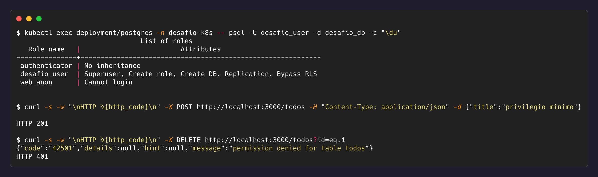

# 4. API conectada ao banco

## Modelo de acesso

O PostgREST expõe o schema do banco como API REST, então o controle do que a API permite
é feito com papéis do PostgreSQL, não com código. A configuração usa dois papéis, como
recomenda a documentação oficial do PostgREST:

| Papel | Atributos | Privilégios |
|---|---|---|
| `authenticator` | `LOGIN`, `NOINHERIT` | nenhum por si só; só pode assumir `web_anon` |
| `web_anon` | `NOLOGIN` | `SELECT`, `INSERT` em `todos` e `USAGE` na sequência |
| `desafio_user` | superusuário, dono do banco | apenas bootstrap/administração; a API não o usa |

A API conecta como `authenticator`, que não tem privilégio nenhum, e o PostgREST faz
`SET ROLE web_anon` para requisições não autenticadas. `NOINHERIT` garante que privilégio
só exista após a troca explícita de papel.

Consequência prática, verificada por [teste automatizado](../tests/test_persistence.py):
`GET` e `POST` em `/todos` funcionam, `DELETE` é recusado pelo próprio banco com
`42501 permission denied`. Nenhuma outra tabela ou operação está ao alcance de uma
requisição anônima.

Os papéis são criados no `init.sh` do
[ConfigMap](../k8s/02-postgres-configmap.yaml), junto com a tabela, então o cluster nasce com
esse modelo aplicado, sem passo manual.



## Conexão pelo Service, não por IP

A string de conexão em [`k8s/01-postgres-secret.example.yaml`](../k8s/01-postgres-secret.example.yaml)
usa `postgres` como host, que é o nome do Service criado no
[nível 2](nivel-2-postgres-pvc.md):

```
postgres://authenticator:<senha>@postgres:5432/desafio_db
```

O IP de um Pod é efêmero: se o Pod do banco é recriado, recebe outro. Uma string com IP
fixo apontaria para um endereço morto até alguém editá-la e reiniciar o Deployment.

O Service resolve isso com uma indireção: `postgres` é um nome DNS estável servido pelo
CoreDNS, que aponta para o `ClusterIP` do Service; o Service, por sua vez, mantém a lista
de Pods de destino por *label*, não por IP. Quando o Pod é recriado, os endpoints são
atualizados automaticamente e a API não percebe diferença. É o que torna possível a prova
de persistência do [nível 5](nivel-5-persistencia.md).

Nos logs da API, a linha de conexão confirma o uso do nome:

```
Listener connected to PostgreSQL ... on "postgres:5432"
```

## Deployment da API

[`k8s/06-postgrest-deployment.yaml`](../k8s/06-postgrest-deployment.yaml): a configuração
inteira (`db-uri`, `db-schemas`, `db-anon-role`) vem do arquivo
`/etc/postgrest/postgrest.conf`, montado a partir do Secret. O container roda como usuário
não-root, com filesystem raiz somente leitura e todas as capabilities Linux removidas.

## Verificação

```bash
kubectl port-forward -n desafio-k8s svc/postgrest 3000:3000
curl http://localhost:3000/todos
```


