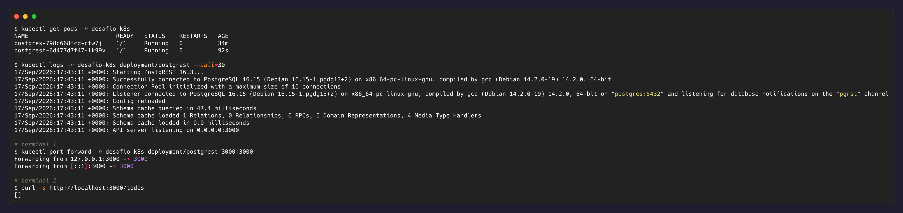

# Nível 4 — A API conectada ao banco (a integração)

## Objetivo

Implantar o PostgREST apontando para o PostgreSQL usando o nome do Service (não IP),
reaproveitando as credenciais do Secret, e confirmar que a API expõe uma tabela real via
HTTP.

## O que foi feito

### 1. Tabela de teste no Postgres

```sql
CREATE TABLE IF NOT EXISTS todos (
  id serial PRIMARY KEY,
  title text NOT NULL,
  done boolean NOT NULL DEFAULT false
);
```

Criada originalmente via `kubectl exec` no Pod do Postgres, como exploração manual deste
nível. `desafio_user` já é dono do banco `desafio_db` (o Postgres oficial torna o
`POSTGRES_USER` do bootstrap automaticamente dono do `POSTGRES_DB`), então nenhum `GRANT`
extra foi necessário.

> **Atualização**: esse passo manual escondia uma lacuna real de reprodutibilidade — um
> cluster novo, sem esse `kubectl exec`, nunca teria a tabela. Foi o próprio `cd.yml`
> quem pegou isso rodando num cluster efêmero pela primeira vez. A criação da tabela
> agora é automática via `/docker-entrypoint-initdb.d/`; detalhes em
> [docs/ci-cd.md](ci-cd.md).

### 2. String de conexão no Secret ([`k8s/01-postgres-secret.yaml`](../k8s/01-postgres-secret.yaml))

```yaml
DATABASE_URL: postgres://<usuario>:<senha>@postgres:5432/desafio_db
```

(valores reais só em [`k8s/01-postgres-secret.yaml`](../k8s/01-postgres-secret.yaml))

**Esta é a peça central do nível**: o host da string de conexão é `postgres` — o nome do
Service criado no Nível 2, não um IP. Isso reaproveita o usuário/senha que já estavam no
Secret desde o Nível 3, só compostos num formato de URI que o PostgREST exige.

### 3. Deployment do PostgREST ([`k8s/06-postgrest-deployment.yaml`](../k8s/06-postgrest-deployment.yaml))

- `PGRST_DB_URI`: vem do Secret (`secretKeyRef` → `DATABASE_URL`).
- `PGRST_DB_SCHEMA: "public"`: qual schema do Postgres o PostgREST deve inspecionar e
  transformar em endpoints REST.
- `PGRST_DB_ANON_ROLE: "desafio_user"`: o papel do Postgres assumido em requisições sem
  autenticação (aqui, todas — não configuramos autenticação). Ver nota de segurança abaixo.

```bash
kubectl apply -f k8s/01-postgres-secret.yaml
kubectl apply -f k8s/06-postgrest-deployment.yaml
kubectl get pods -n desafio-k8s -w
kubectl logs -n desafio-k8s deployment/postgrest
```

Nos logs, a linha `Listener connected to PostgreSQL ... on "postgres:5432"` confirma a
conexão pelo nome do Service.

### 4. Teste ponta a ponta

```bash
kubectl port-forward -n desafio-k8s deployment/postgrest 3000:3000
# em outro terminal:
curl http://localhost:3000/todos
```

Retornou `[]` — a tabela existe, está vazia, e a API a expõe via HTTP. O `port-forward`
aqui é só uma ferramenta de debug local (fala direto com o Pod, ignorando Service); a
exposição de verdade da API é o Nível 5.

## ⚠️ Nota de segurança: `PGRST_DB_ANON_ROLE` reaproveitando o dono da tabela

Assim como o Secret em texto plano (Nível 3), isto é uma simplificação proposital do
desafio, não uma prática de produção. Em uma API PostgREST real, o papel usado para
requisições anônimas (`PGRST_DB_ANON_ROLE`) deveria ser uma conta **separada e mínima**
(ex: `web_anon`), criada só com os `GRANT`s estritamente necessários (normalmente só
`SELECT`, e só nas tabelas que devem ser públicas). Usar `desafio_user` — que é dono da
tabela e tem privilégio total, incluindo `DROP TABLE` — significa que **qualquer
requisição não autenticada herda esse mesmo poder**.

A separação correta envolveria criar, dentro do Postgres:

```sql
CREATE ROLE web_anon NOLOGIN;
GRANT USAGE ON SCHEMA public TO web_anon;
GRANT SELECT ON todos TO web_anon;
```

E um papel `authenticator` (com `LOGIN`, sem privilégios diretos) que a API usaria para
conectar e depois trocar (`SET ROLE`) para `web_anon` ou para papéis autenticados,
conforme a documentação oficial do PostgREST recomenda. Isso fica fora do escopo deste
desafio (que pede explicitamente reaproveitar o usuário/senha existentes), mas é
importante deixar registrado como a diferença entre "funciona" e "é seguro".

## Evidências



## Reflexão

**Por que usamos o nome do Service do Postgres na string de conexão, em vez do IP do
Pod? O que aconteceria com a conexão se você usasse o IP e o Pod do banco fosse
recriado?**

O IP de um Pod é efêmero — vinculado ao ciclo de vida daquele Pod específico. Se o Pod do
Postgres for deletado e recriado (por qualquer motivo: falha, atualização, realocação de
nó), o Pod novo recebe um **IP diferente**. Uma `DATABASE_URL` com o IP hardcoded ficaria
apontando para um endereço que não existe mais — a API entraria em erro de conexão até
alguém atualizar manualmente a string e reiniciar o Deployment.

O Service resolve isso com um nível de indireção: `postgres` é um nome DNS estável,
resolvido pelo CoreDNS do cluster, que sempre aponta para o `ClusterIP` do Service — e o
Service, por sua vez, mantém automaticamente a lista de quais Pods (por label, não por
IP fixo) devem receber o tráfego. Quando o Pod do Postgres é recriado, o Service percebe
a mudança de IP e atualiza seus endpoints sozinho; do ponto de vista da API, nada mudou —
ela continua resolvendo `postgres` para o mesmo nome, que agora aponta para o Pod novo.

É exatamente esse mecanismo que torna possível a prova de persistência do Nível 5: a API
nunca precisa "saber" que o Pod do banco foi recriado.
