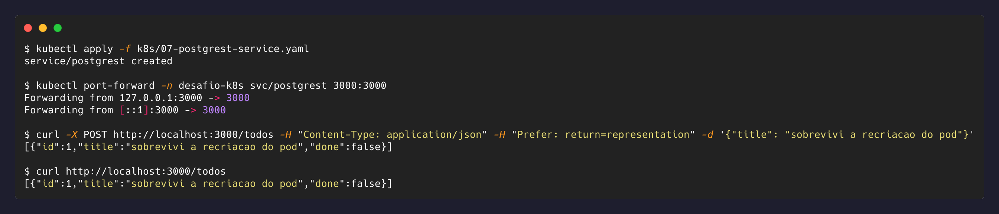
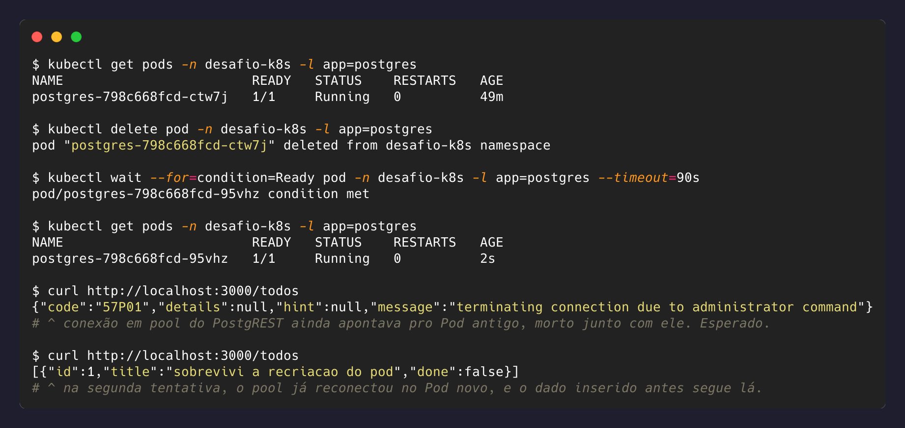

# 5. Exposição da API e prova de persistência

## Exposição

[`k8s/07-postgrest-service.yaml`](../k8s/07-postgrest-service.yaml) é um `ClusterIP`, e o
acesso externo é feito com `kubectl port-forward`, que cria um túnel entre uma porta local
e o Service:

```bash
kubectl port-forward -n desafio-k8s svc/postgrest 3000:3000
```

Em um cluster real a escolha seria `Ingress` (roteamento por host/path, TLS terminado no
edge) ou `LoadBalancer` em nuvem. Em cluster local sem controlador de Ingress instalado,
`port-forward` entrega o mesmo resultado para validação sem infraestrutura adicional.

## Prova

Inserir um registro pela API:

```bash
curl -X POST http://localhost:3000/todos \
  -H "Content-Type: application/json" \
  -H "Prefer: return=representation" \
  -d '{"title": "sobrevivi a recriacao do pod"}'
```



Destruir o Pod do banco e esperar o Deployment recriá-lo:

```bash
kubectl delete pod -n desafio-k8s -l app=postgres
kubectl wait --for=condition=Ready pod -n desafio-k8s -l app=postgres --timeout=90s
curl http://localhost:3000/todos
```



O Pod recriado tem sufixo diferente: é um Pod novo, e o dado continua lá.

## Reconexão do pool

A primeira requisição logo após a recriação pode retornar
`57P01 — terminating connection due to administrator command`: o pool de conexões do
PostgREST ainda mantinha uma conexão para o Pod destruído. Na tentativa seguinte a
conexão morta é descartada e o pool reconecta pelo mesmo nome de Service, sem intervenção.

O comportamento está registrado na evidência acima em vez de omitido, e o
[teste automatizado](../tests/test_persistence.py) trata isso explicitamente com retry:
um cliente de produção precisaria da mesma tolerância.

## O que precisou funcionar junto

A sobrevivência do dado depende de seis componentes independentes, cada um cuidando de um
pedaço do estado:

| Componente | Responsabilidade |
|---|---|
| PVC | manter os dados fora do ciclo de vida do Pod |
| Deployment do Postgres | recriar o Pod destruído |
| Secret | entregar as mesmas credenciais ao Pod novo |
| Service do Postgres | manter o endereço estável apesar da troca de IP |
| Deployment do PostgREST | seguir no ar e reconectar o pool |
| Service do PostgREST | manter o ponto de acesso do cliente inalterado |

Nenhum deles conhece os outros. O Deployment do banco não sabe que existe uma API
dependendo dele; apenas mantém o número de réplicas correto. A auto-recuperação emerge da
composição de loops de reconciliação simples e independentes, não de um componente central
que orquestra tudo.
