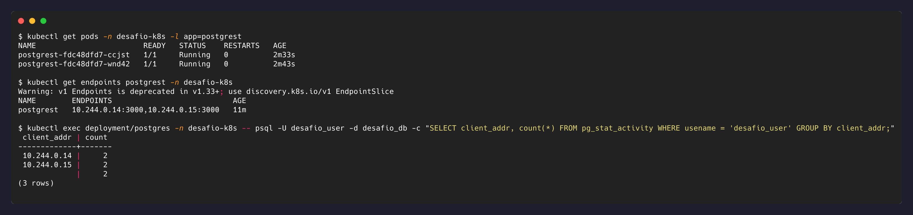

# Nível 6 — Health checks e escala

## Objetivo

Adicionar liveness e readiness probes à API, definir requests/limits de CPU e memória, e
aumentar o número de réplicas, observando o Service balancear a carga entre elas.

## O que foi feito

Todas as mudanças ficam em [`k8s/06-postgrest-deployment.yaml`](../k8s/06-postgrest-deployment.yaml)
(o Postgres continua com `replicas: 1` — não muda, ver reflexão abaixo).

### 1. Requests e Limits

```yaml
resources:
  requests:
    cpu: 100m
    memory: 64Mi
  limits:
    cpu: 250m
    memory: 128Mi
```

`requests` é o que o Pod reserva garantido no nó (usado pelo scheduler pra decidir onde
encaixar o Pod); `limits` é o teto que ele nunca pode ultrapassar — passar do limit de
memória mata o container (`OOMKilled`), passar do limit de CPU só faz o container ser
limitado (throttled), não morre.

### 2. Liveness e Readiness probes

```yaml
livenessProbe:
  httpGet:
    path: /
    port: 3000
  initialDelaySeconds: 5
  periodSeconds: 10
readinessProbe:
  httpGet:
    path: /todos
    port: 3000
  initialDelaySeconds: 5
  periodSeconds: 5
```

Os dois fazem uma pergunta diferente:

- **Liveness** (`GET /`, a raiz do PostgREST, que só depende do schema já cacheado em
  memória): "o processo está travado?" Se falhar repetidamente, o Kubernetes **mata e
  reinicia** o container.
- **Readiness** (`GET /todos`, que exige ida real ao banco): "esse Pod está pronto pra
  receber tráfego **agora**?" Se falhar, o Kubernetes **remove o Pod da lista de
  endpoints do Service** — ele continua rodando, só para de receber requisições, até a
  probe voltar a passar.

Por isso os dois caminhos são diferentes de propósito: se o Postgres cair
temporariamente, a readiness falha (correto — a API não deve receber tráfego que ela não
consegue atender), mas a liveness continua passando (correto — o processo do PostgREST
em si não travou, não faz sentido reiniciá-lo por um problema que não é dele).

### 3. Réplicas

```yaml
replicas: 2
```

```bash
kubectl apply -f k8s/06-postgrest-deployment.yaml
kubectl rollout status deployment/postgrest -n desafio-k8s
```

Como a mudança de spec (probes/limits) dispara um rolling update de qualquer forma, a
mudança de réplicas foi aplicada junto, no mesmo `apply`.

### 4. Confirmando o balanceamento

PostgREST não gera log de acesso por requisição por padrão nessa versão, então usei uma
evidência indireta: cada réplica mantém seu próprio pool de conexões com o Postgres. Se
as duas estiverem realmente ativas (não só "rodando", mas de fato integradas ao Service),
o Postgres deve enxergar conexões vindas dos IPs das duas.

```bash
kubectl get endpoints postgrest -n desafio-k8s
kubectl exec deployment/postgres -n desafio-k8s -- psql -U desafio_user -d desafio_db \
  -c "SELECT client_addr, count(*) FROM pg_stat_activity WHERE usename = 'desafio_user' GROUP BY client_addr;"
```

Os dois IPs retornados pelo `pg_stat_activity` (`10.244.0.14`, `10.244.0.15`) batem
exatamente com os dois IPs de `kubectl get endpoints` — confirma que as duas réplicas do
PostgREST têm conexão própria e ativa com o banco.

## Evidências



## Reflexão

**Qual a diferença prática entre liveness e readiness? Por que escalar a API para várias
réplicas é seguro, mas escalar o banco desse jeito (com o mesmo PVC) não seria?**

A diferença entre as probes já está detalhada acima: liveness decide **reiniciar**,
readiness decide **rotear tráfego ou não**. Na prática, liveness protege contra um
processo travado; readiness protege contra mandar tráfego pra um Pod que está de pé mas
incapaz de responder direito.

Sobre escalar API vs. banco: a API (PostgREST) é **sem estado** — cada réplica não guarda
nada localmente entre requisições; todo o estado real mora no Postgres, atrás do Service.
Isso significa que qualquer réplica pode atender qualquer requisição, e o Service já
resolve a distribuição de carga automaticamente (é exatamente o que a evidência acima
comprova). Adicionar ou remover réplicas da API não arrisca nada.

O Postgres é **stateful**, e pior: está montado num PVC `ReadWriteOnce`, que só permite
um único Pod escrevendo naquele volume por vez. Se o Deployment do Postgres fosse
escalado para 2 réplicas hoje, o segundo Pod tentaria montar o **mesmo** PVC e ficaria
preso em `Pending` (o volume já está em uso pelo primeiro). Mesmo que fosse tecnicamente
possível montar o mesmo disco em dois Pods (não é, com `ReadWriteOnce`), duas instâncias
de Postgres escrevendo no mesmo diretório de dados sem coordenação corromperiam o banco —
Postgres não foi feito pra múltiplas instâncias compartilhando o mesmo diretório de
dados. Escalar um banco de verdade exige replicação em nível de aplicação (streaming
replication, um primary e réplicas de leitura), não simplesmente aumentar `replicas` no
Deployment.
