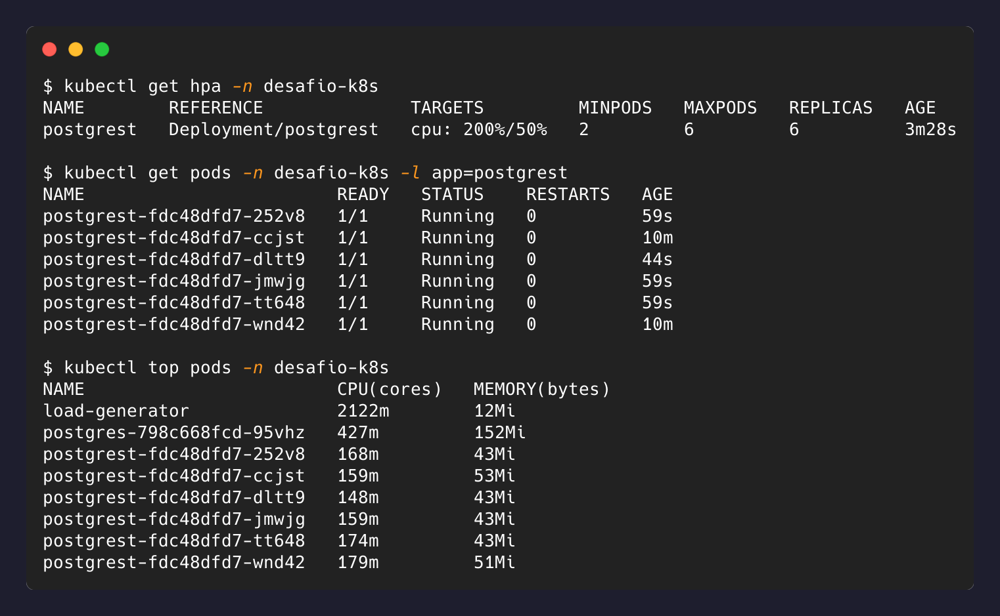
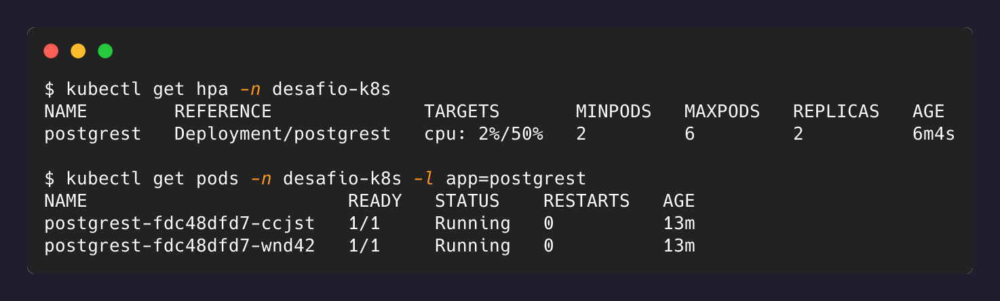

# 7 — Escalonamento automático

## metrics-server

O HPA precisa de métricas de uso de CPU, que o `kind` não fornece por padrão:

```bash
kubectl apply -f https://github.com/kubernetes-sigs/metrics-server/releases/latest/download/components.yaml
kubectl patch deployment metrics-server -n kube-system --type=json \
  -p '[{"op": "add", "path": "/spec/template/spec/containers/0/args/-", "value": "--kubelet-insecure-tls"}]'
```

O patch é necessário porque o `metrics-server` valida o certificado TLS do kubelet de cada
nó, e o `kind` usa certificados autoassinados. Sem ele o componente sobe mas nunca reporta
métricas. Em cluster gerenciado (EKS, GKE, AKS) o `metrics-server` já vem instalado e
configurado, e este passo não existe.

Não está em `k8s/` porque é componente de infraestrutura do cluster, não da aplicação.

## HorizontalPodAutoscaler

[`k8s/08-postgrest-hpa.yaml`](../k8s/08-postgrest-hpa.yaml):

```yaml
minReplicas: 2
maxReplicas: 6
metrics:
  - type: Resource
    resource:
      name: cpu
      target:
        type: Utilization
        averageUtilization: 50
behavior:
  scaleDown:
    stabilizationWindowSeconds: 30
```

`averageUtilization: 50` é relativo ao `requests.cpu` de 100m definido no
[nível 6](nivel-6-probes-escala.md) — o HPA mira em ~50m médios por Pod.

A janela de estabilização de scale-down é de 30s; o padrão do Kubernetes é 300s, pensado
para evitar oscilação em resposta a picos curtos. O valor reduzido aqui torna o
comportamento observável em uma demonstração; em produção o padrão é a escolha segura, e
essa diferença é deliberada e local.

## Geração de carga

```bash
kubectl run load-generator -n desafio-k8s --image=busybox:stable --restart=Never -- \
  /bin/sh -c "for i in 1 2 3 4; do (while true; do wget -q -O- http://postgrest:3000/todos > /dev/null; done) & done; wait"
```

O gerador roda dentro do cluster e acessa o Service pelo nome, sem depender de
`port-forward` (que roda na máquina host e não sustenta carga contínua de forma confiável).

## Resultado

Sob carga, CPU a 200% do alvo e escala até o teto configurado:



Removida a carga, retorno ao mínimo:



O HPA fecha o ciclo preparado no nível anterior: como a API é stateless e o Service já
distribui entre os endpoints existentes, adicionar e remover réplicas é seguro e pode ser
delegado a um controlador reagindo a métricas reais.
